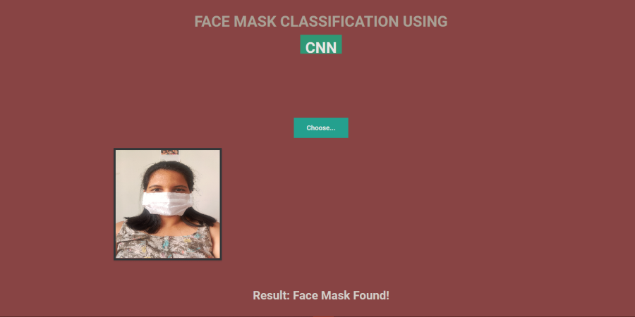

# Facemask-Classification-2.0
Face Mask Classification using Transferred  Learning [Link](https://face-mask-2.herokuapp.com/)

## About
This is a mini project which aims to classify face mask using CNN. It is and end to end project which includes deployment on heroku platform link. Basically it takes image as an input and predicts whether a given person in the image is wearing face mask or not.

## Idea behind it
Due to covid-19 by far wearing a face mask is the only proven solution for not getting infected by it unless and until a proper vaccine has been introduced. This mini project helps to classify if face mask is present or not in order to prevent the spread of the infection.

## Screen Shot


## Folder Structure

```
├── static
│   ├── CSS
│   │    ├──main.css
│   ├── JS
|   │    ├──main.js
│   ├── design2.css
│   └── design3.css
├── templates
│   ├── base.html
|   └── new.html
├── FM mod.ipynb
├── LICENSE
├── README.md
├── app.py
├── my_trained.h5
├── ss1.png
└── requirements.txt
```
## How to..
1) If you want simply run it on local machine, then firstly install requirements.txt using the command  ```pip install requirements.txt``` in cmd/terminal.
2) Then run app.py file in termal/command promp a local url will be available, copy and paste it in your browser.
3) Or if you want to retrain the model then use the file FM mod.ipynb (model is already trained and saved as my_trained.h5).
4) Dataset folder consist on images with two classes i.e with and without-mask each for train and test images.
5) You can check the deployed [link](https://face-mask-2.herokuapp.com/).

## Techlogy Stack
1) Numpy
2) Keras
3) Tensorflow
4) Flask
5) Heroku Cloud
6) HTML
7) CSS
8) Java script
9) Python
